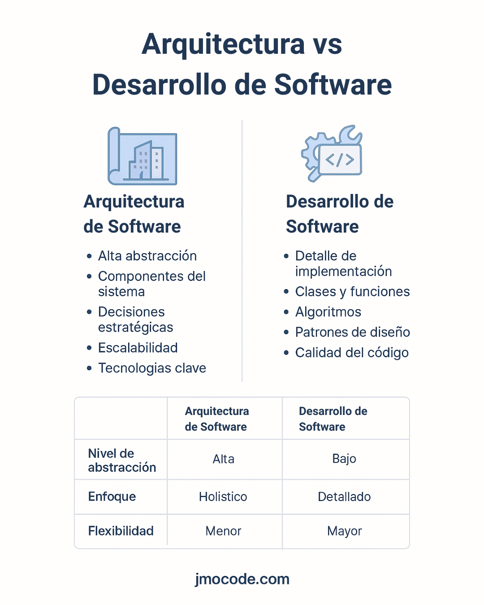
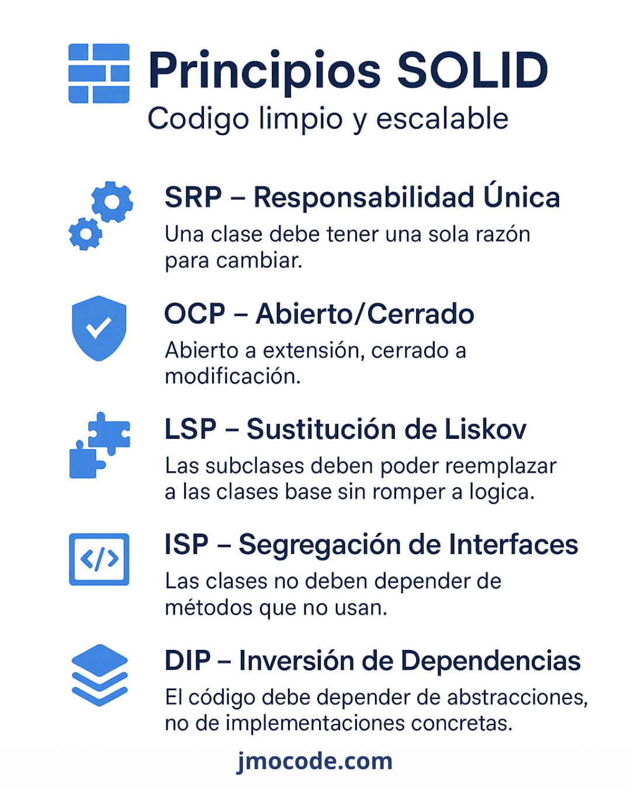
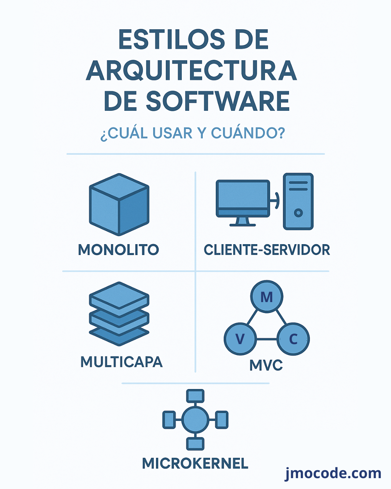

# Arquitectura de Software 🏗️

> Este repositorio tiene fines educativos para aprender sobre Arquitectura y Desarrollo de Software. ¡Toda contribución y ayuda es bienvenida! Si deseas colaborar, no dudes en hacer un pull request o abrir un issue.

## Índice 📑

- [Introducción a la Arquitectura de Software](#introducción-a-la-arquitectura-de-software)
  - [¿Qué es la arquitectura de software?](#qué-es-la-arquitectura-de-software)
  - [¿Qué es el Desarrollo de software?](#qué-es-el-desarrollo-de-software)
  - [Arquitectura vs Desarrollo: Diferencias Clave](#arquitectura-vs-desarrollo-diferencias-clave)
  - [Roles y Responsabilidades](#roles-y-responsabilidades)

- [Principios SOLID](#principios-solid)
  - [Principio de Responsabilidad Única (SRP)](#principio-de-responsabilidad-única-srp)
  - [Principio Abierto-Cerrado (OCP)](#principio-abierto-cerrado-ocp)
  - [Principio de Sustitución de Liskov (LSP)](#principio-de-sustitución-de-liskov-lsp)
  - [Principio de Segregación de Interfaces (ISP)](#principio-de-segregación-de-interfaces-isp)
  - [Principio de Inversión de Dependencias (DIP)](#principio-de-inversión-de-dependencias-dip)
  - [Resumen de SOLID](#resumen-de-solid)

- [Estilos Arquitectónicos](#estilos-arquitectónicos)
  - [Monolito](#monolito)
  - [Cliente-Servidor](#cliente-servidor)
  - [Multicapa](#multicapa)
  - [MVC](#mvc)
  - [Microkernel](#microkernel)
  - [Comparativa de Estilos](#comparativa-de-estilos)

- [Estilos de despliegue](#estilos-de-despliegue)
  - [Microservicios](#microservicios)
  - [Serverless](#serverless)
  - [Comparativa Microservicios vs Serverless](#comparativa-microservicios-vs-serverless)

---

## Introducción a la Arquitectura de Software

### ¿Qué es la arquitectura de software? 

La arquitectura de software se puede entender desde tres perspectivas fundamentales:

#### Visión de alto nivel
Es el "esqueleto" o blueprint de un sistema. Define:
- Los componentes principales
- Sus relaciones e interfaces
- Los entornos de ejecución
- Cómo estos elementos se integran para satisfacer tanto requisitos funcionales como no funcionales (rendimiento, disponibilidad, seguridad)

#### Gestión de la complejidad
Proporciona una abstracción para organizar sistemas de gran escala, equilibrando factores críticos como:
- Tiempos de respuesta
- Tolerancia a fallos
- Escalabilidad
- Costos operativos

#### Decisiones estratégicas
Determina aspectos cruciales como:
- Selección de tecnologías
- Estrategias de escalamiento
- Patrones arquitectónicos a evitar
- Decisiones tempranas de alto impacto

### ¿Qué es el Desarrollo de software? 

#### Visión detallada
Define la implementación específica de cada módulo o componente:
- Clases y funciones
- Estructuras de datos
- Algoritmos
- APIs
- Patrones de Desarrollo a nivel local

#### Plan de implementación
- Guía a los desarrolladores
- Describe interfaces y relaciones
- Define métodos para cumplir requisitos funcionales

#### Enfoque práctico
Se centra en aspectos como:
- Corrección del código
- Eficiencia
- Claridad
- Facilidad de mantenimiento

### Arquitectura vs Desarrollo: Diferencias Clave 

| Aspecto              | Arquitectura                                        | Desarrollo 
|----------------------|-----------------------------------------------------|--------------------------------------------------
| Nivel de abstracción | Alto – esqueleto/fundación del sistema              | Detallado – módulos individuales 
| Pregunta clave       | ¿Qué se construye y dónde?                          | ¿Cómo se construye? 
| Enfoque principal    | Componentes, interacción, calidad del sistema       | Clases, métodos, estructuras de datos, algoritmos 
| Requisitos           | Funcionales + No funcionales (seguridad, escalado…) | Principalmente funcionales 
| Flexibilidad         | Rígido – cambios son costosos                       | Más fácil de cambiar y ajustar 
| Ejemplos             | Microservicios, C4, MVC                             | Singleton, Strategy, Builder, etc. 

La arquitectura establece la estructura general y las decisiones de Desarrollo de sistemas completos, mientras que el Desarrollo detalla las piezas individuales, definiendo módulos concretos y el flujo interno para materializar la visión arquitectónica.



### Roles y Responsabilidades 

#### Arquitecto de Software
- Define la estructura general del sistema
- Selecciona tecnologías y patrones
- Alinea la arquitectura con objetivos de negocio
- Balancea aspectos de rendimiento, costo y seguridad
- Interactúa con stakeholders
- Documenta decisiones arquitectónicas
- Lidera visiones cross-equipo (Enterprise vs Solution Architect)

#### Desarrollador de Software
- Traduce la visión arquitectónica en componentes concretos
- Define clases, interfaces y flujos
- Implementa algoritmos
- Desarrolla pruebas unitarias
- Aplica patrones de Desarrollo (creacional, estructural, comportamental)
- Se enfoca en la calidad del código


## Principios SOLID 

### Principio de Responsabilidad Única (SRP) 

**Definición**: Cada módulo o clase debe tener una única razón para cambiar.

La Separación de Responsabilidades (SoC) va de la mano: divide el sistema en partes con responsabilidades distintas.

#### 📌 Ejemplo en Python (malo vs. bien)

❌ **Violación de SRP**: mezcla lectura y compresión
```python
class FileManager:
    def __init__(self, filename):
        self.filename = filename

    def read(self):
        # lee archivo
        pass

    def write(self, data):
        # escribe archivo
        pass

    def compress(self):
        # comprime archivo
        pass

    def decompress(self):
        # descomprime archivo
        pass
```

✅ **Solución**: separa responsabilidades:
```python
class FileManager:
    def __init__(self, filename):
        self.filename = filename

    def read(self): pass
    def write(self, data): pass

class Compressor:
    def compress(self, filename): pass
    def decompress(self, filename): pass
```

### Principio Abierto-Cerrado (OCP) 

**Definición**: Los módulos deben estar abiertos a extensión, pero cerrados a modificación.

#### 📌 Ejemplo en Python

❌ **Violación**: cada vez que agregas un formato, modificas la clase
```python
class Report:
    def output(self, format):
        if format == "json":
            # ...
            pass
        elif format == "xml":
            # ...
            pass
```

✅ **Solución**: usa polimorfismo / interfaces:
```python
class Report:
    def __init__(self, formatter):
        self.formatter = formatter

    def output(self, data):
        return self.formatter.format(data)

class JSONFormatter:
    def format(self, data): pass

class XMLFormatter:
    def format(self, data): pass

# Extender: sólo creas nueva clase Formatter, no modifies Report
```

## Principio de Sustitución de Liskov (LSP) 

**Definición**: Los objetos de una clase derivada deben poder sustituir a la clase base sin cambiar el comportamiento.

#### 📌 Ejemplo en Python

❌ **Violación**:
```python
class Bird:
    def fly(self): pass

class Sparrow(Bird):
    def fly(self): pass  # correcto

class Penguin(Bird):
    def fly(self):
        raise NotImplementedError
# ❌ Violación: Penguin no puede volar, rompe el contrato de la clase base
```

✅ **Solución**: reorganiza la jerarquía:
```python
class Bird: pass

class FlyingBird(Bird):
    def fly(self): pass

class Sparrow(FlyingBird): pass
class Penguin(Bird): pass
```

## Principio de Segregación de Interfaces (ISP) 

**Definición**: Los clientes no deben depender de interfaces que no usan.

#### 📌 Ejemplo en Python

❌ **Violación**:
```python
class Worker:
    def work(self): pass
    def eat(self): pass

class Robot(Worker):
    def work(self): pass
    def eat(self): raise NotImplementedError  # ❌ Violación de ISP
```

✅ **Solución**: define interfaces segmentadas:
```python
class Workable:
    def work(self): pass

class Eatable:
    def eat(self): pass

class Human(Workable, Eatable):
    def work(self): pass
    def eat(self): pass

class Robot(Workable):
    def work(self): pass
```

## Principio de Inversión de Dependencias (DIP) 

**Definición**: Los módulos de alto nivel no deben depender de los de bajo nivel, ambos deben depender de abstracciones.

#### 📌 Ejemplo en Python

❌ **Violación**: Acoplamiento directo
```python
class MySQLDatabase:
    def connect(self): pass

class UserRepository:
    def __init__(self):
        self.db = MySQLDatabase()

    def get_user(self, id):
        self.db.connect()
        # ...
```

✅ **Solución**: depende de una abstracción:
```python
from abc import ABC, abstractmethod

class Database(ABC):
    @abstractmethod
    def connect(self): pass

class MySQLDatabase(Database):
    def connect(self): pass

class UserRepository:
    def __init__(self, db: Database):
        self.db = db

    def get_user(self, id):
        self.db.connect()
        # ...
```

## Resumen de SOLID

| Principio | Qué logra | Ejercicio práctico |
|-----------|-----------|-------------------|
| SRP | Clases con responsabilidad única | Refactorizar FileManager |
| OCP | Sistema extensible sin alterar código existente | Añadir formatos a Report |
| LSP | Subclases compatibles con superclases | Reorganizar jerarquías de pájaros |
| ISP | Evitar interfaces "hinchadas" | Dividir Worker en Workable/Eatable |
| DIP | Acoplamiento a abstracciones | Inyectar Database en repositorio |



## Estilos Arquitectónicos

### Monolito

#### Definición
Aplicación empaquetada como una sola unidad: UI, lógica de negocio y acceso a datos en el mismo deployment.

#### Ventajas
- Desarrollo y despliegue rápidos; un solo repositorio
- Fácil compartir código (modelos, utilidades) internamente

#### Desventajas
- A medida que crece, mantenimiento y escalabilidad se complican
- Un cambio puede impactar toda la app; difícil escalado

#### Cuándo usarlo
- MVP o proyectos pequeños
- Equipos reducidos con necesidad de velocidad de desarrollo

### Cliente-Servidor

#### Definición
Dos componentes críticos:
- Cliente: interface UX
- Servidor: lógica y datos
- Comunicación por petición/respuesta

#### Ventajas
- Separación clara de responsabilidades
- Puede escalar el servidor

#### Desventajas
- La lógica de negocio queda centralizada; cliente está limitado
- Las variantes de arquitectura (1-tier, 2-tier, n-tier) agregan complejidad

### Multicapa (Layered / N-Tier)

#### Definición
Descompone el sistema en capas:
- Presentación
- Lógica de negocio
- Acceso a datos
Cada capa comunica solo con la adyacente.

#### Ventajas
- Buena separación de responsabilidades
- Permite reemplazar capas independientemente

#### Desventajas
- Puede volverse lento por múltiples pasos
- Riesgo de acoplamientos innecesarios

#### Cuándo usarlo
- Enterprise apps con lógica compleja

### MVC (Model-View-Controller)

#### Definición
- Modelo: datos y lógica
- Vista: UI
- Controlador: conecta usuario y modelo

#### Ventajas
- Alto grado de desacoplamiento
- Ideal para apps con múltiples canales de UI

#### Desventajas
- Puede ser complejo de implementar en sistemas no triviales

#### Cuándo usarlo
- Frameworks web/mobile (Django, Rails, ASP.NET)

### Microkernel (Plug-in)

#### Definición
Core mínimo con funcionalidades básicas, ampliable con plug-ins independientes.

#### Ventajas
- Extensible sin tocar el core
- Aislamento: un plug-in falla, otros siguen operando

#### Desventajas
- Mayor sobrecarga y complejidad en gestión de plug-ins
- Comunicación inter-módulos puede ser lenta

#### Cuándo usarlo
- IDEs (Eclipse), sistemas modulares, SOs, plataformas con extensiones

### Comparativa de Estilos

| Estilo | Ventajas principales | Desventajas principales | Caso de uso típico |
|--------|---------------------|------------------------|-------------------|
| Monolito | Simplicidad, velocidad | Escalabilidad y mantenimiento complejos | MVPs, prototipos |
| Cliente-Servidor | Separación lógica, escalabilidad | Lógica concentrada en servidor, variantes complicadas | Apps web clásicas |
| Multicapa | Separación clara, mantenibilidad | Rendimiento y acoplamientos cruzados | Sistemas enterprise |
| MVC | Desacoplamiento UI-lógica-datos, reutilizable | Complejo al escalar | Frameworks web, apps con múltiples vistas |
| Microkernel | Extensible, modular, aislable | Gestión de extensiones costosa, overhead | IDEs, plataformas con plugins |

#### Conclusión de estilos arquitectonicos.
- Monolito → para arrancar rápido
- Cliente-Servidor / Multicapa → cuando hay lógica de negocio y UI diferenciada
- MVC → perfecto para aplicaciones orientadas a UI
- Microkernel → cuando quieras flexibilidad máxima y extensibilidad



## Estilos de despliegue

### Microservicios

#### Definición
Una arquitectura que divide una aplicación en servicios pequeños e independientes, cada uno con su propia base de datos, lógica de negocio y despliegue.

#### Ventajas
- Escalabilidad independiente: cada servicio puede escalar según demanda
- Despliegue continuo: permite actualizaciones sin afectar el sistema completo
- Tolerancia a fallos: si un servicio falla, los demás siguen operando
- Flexibilidad tecnológica: distintos lenguajes y tecnologías por servicio
- Equipos autónomos: facilita desarrollo paralelo y ramp-up rápido

#### Desventajas
- Mayor complejidad operativa: orquestación, monitoreo, CI/CD, descubrimiento de servicios
- Latencia de red: comunicación vía API introduce sobrecarga
- Consistencia de datos difícil: cada servicio maneja su propio storage
- Costos mayores: más infraestructura, bases, pipelines, logs
- Pruebas y debugging complejos debido a la distribución
- Requiere cultura DevOps madura y habilidades específicas

Nota importante: "If you do not need micro services, do not use them. They will be a pain."

### Serverless (Function as a Service)

#### Definición
Modelo donde ejecutas funciones en la nube sin gestionar servidores. Se activan por eventos (HTTP, colas, cron), con escalado y facturación automática.

#### Ventajas
- Coste por uso real: solo pagas por ejecución, no por capacidad reservada
- Sin infra-ops: no hay que gestionar servidores ni parcheo
- Escalado automático: ajusta capacidad según tráfico
- Desarrollo rápido: enfócate en la lógica sin preocuparte de entorno
- Ecosistema maduro: integración fluida con servicios cloud

#### Desventajas
- Cold starts: retrasos al invocar funciones inactivas
- Vendor lock-in: APIs dependientes del proveedor
- Límites de ejecución: restricción en RAM, CPU, duración
- Debugging y monitorización complejos
- Seguridad distribuida: múltiples puntos de entrada, cada función es un vector potencial
- No ideal para procesamiento prolongado (eternal loops, cargas HPC)

### Comparativa Microservicios vs Serverless

| Característica | Microservicios | Serverless |
|---------------|----------------|------------|
| Infraestructura | Contenedores/VMs + CI/CD | FaaS, gestión infra nula |
| Escalado | Manual/automático por servicio | Totalmente automático |
| Facturación | Recursos provisionados | Solo por ejecución y uso |
| Tiempo de respuesta | Estable, baja latencia | Puede haber "cold start" |
| Desarrollo | Flujo flexible, pero complejo | Muy rápido para funciones específicas |
| Casos típicos | Grandes apps, dominio claro | APIs, ETL, cron jobs, eventos |
| Restricciones | Complejidad operativa alta | Límites de tiempo, vendor lock-in |

#### Casos de uso recomendados

##### Microservicios
- Sistemas grandes, de múltiples dominios
- Equipos autónomos necesitan despliegues independientes
- Necesidad de alta disponibilidad sin romper toda la aplicación
- Escalado granular según carga

##### Serverless
- APIs, procesamiento por evento, tareas programadas
- Startups o prototipos con tiempos al mercado reducidos
- Flujos intermitentes donde no se justifica infraestructura manual
- Integración con servicios cloud (auth, mailing, colas...)

#### Conclusión
- Usa microservicios cuando necesitas independencia, escalado fino y tienes la infraestructura DevOps para gestionarlos
- Usa serverless si buscas rapidez, eficiencia de costos y cargas event-driven ligeras
- En proyectos reales, es común combinar ambos: microservicios gestionan dominio central, mientras funcionalidades auxiliares usan serverless


